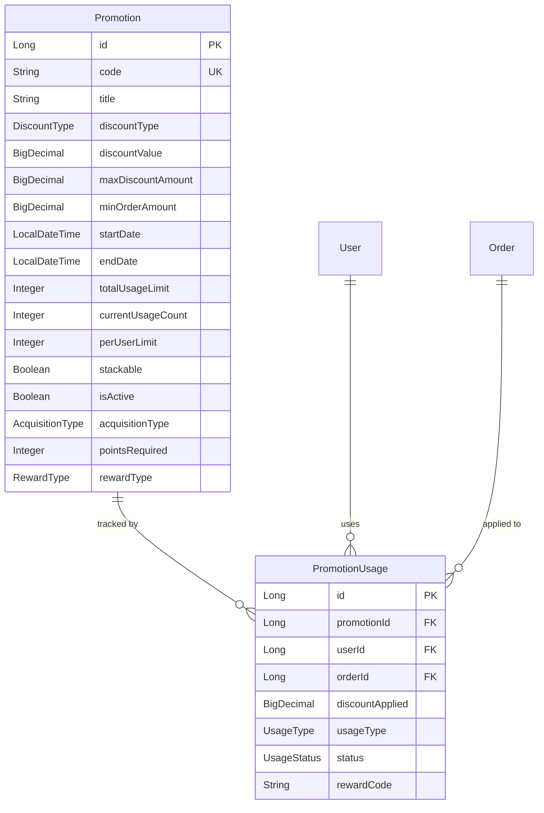
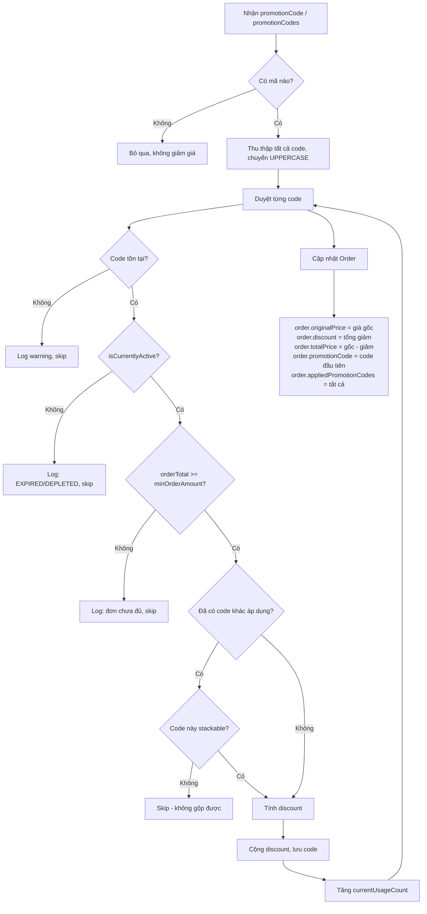

# 🎫 Hướng Dẫn Toàn Diện: Hệ Thống Voucher / Discount / Promotion

<!-- CURRENT_STATUS_START -->
> **Cập nhật 2026-06-13:** Tài liệu này đã được rà soát để bám theo trạng thái hiện tại của dự án. Backend Phase 2 cho locker flow đã triển khai SEND / RENTAL / QR / RBAC / maintenance; FE admin build pass; Flutter mobile đã có luồng Customer, Manager và Maintenance. Nguồn trạng thái chuẩn: `laundry-locker-microservices/docs/CURRENT_PROJECT_STATUS.md`, `RUN_RESULT.md`, `LOCKER_FLOW_PLAN.md`.
<!-- CURRENT_STATUS_END -->

---

## 1. Tổng Quan Kiến Trúc

Hệ thống khuyến mãi được xây dựng trên **2 entity chính** nằm trong module `admin`:



---

## 2. Các Enum Quan Trọng

### DiscountType — Loại giảm giá

| Giá trị | Ý nghĩa | Cách tính |
|---------|---------|-----------|
| `PERCENTAGE` | Giảm theo % | `orderTotal × discountValue / 100`, cap bởi `maxDiscountAmount` |
| `FIXED_AMOUNT` | Giảm số tiền cố định | `discountValue` (VD: 20.000đ) |
| `FREE_SERVICE` | Miễn phí dịch vụ | Giảm = giá dịch vụ (đang TODO) |

### AcquisitionType — Cách khách nhận được mã

| Giá trị | Ý nghĩa |
|---------|---------|
| `CODE` | Mã khuyến mãi truyền thống (nhập khi tạo đơn) |
| `POINTS` | Đổi từ điểm loyalty |
| `AUTO` | Tự động áp dụng |

### RewardType — Loại phần thưởng (dùng cho loyalty)

| Giá trị | Ý nghĩa |
|---------|---------|
| `DISCOUNT` | Giảm giá đơn hàng |
| `FREE_SERVICE` | Miễn phí dịch vụ giặt |
| `MERCHANDISE` | Quà vật lý |
| `VOUCHER` | Voucher/gift card |

### Promotion Status (computed, không lưu DB)

| Status | Điều kiện |
|--------|----------|
| `ACTIVE` | `isActive=true` + `startDate ≤ now ≤ endDate` + chưa hết lượt |
| `UPCOMING` | `isActive=true` + `startDate > now` |
| `EXPIRED` | `endDate < now` |
| `DEPLETED` | `currentUsageCount ≥ totalUsageLimit` |
| `INACTIVE` | `isActive=false` |

### PromotionUsage Enums

**UsageType:** `PROMO_CODE` (dùng mã KM) · `POINTS_REDEMPTION` (đổi điểm)

**UsageStatus:** `ACTIVE` (sẵn sàng) · `USED` (đã dùng) · `EXPIRED` (hết hạn) · `CANCELLED` (bị hủy)

---

## 3. Admin API — Quản Lý Promotion

> Tất cả API trong phần này yêu cầu `@PreAuthorize("hasRole('ADMIN')")` trừ Validate Code.

**Base URL:** `/api/admin/promotions`

---

### 3.1. Tạo Promotion Mới

| Thông tin | Chi tiết |
|-----------|----------|
| **Endpoint** | `POST /api/admin/promotions` |
| **Authorization** | `Bearer {JWT Admin}` |
| **Service** | [PromotionService.createPromotion()](file:///d:/BigProject/laundry-locker-backend/laundry-locker-backend/src/main/java/com/huynqb/laundrylockerbackend/module/admin/service/PromotionService.java#L35-L83) |

#### Request Body — [PromotionRequest](file:///d:/BigProject/laundry-locker-backend/laundry-locker-backend/src/main/java/com/huynqb/laundrylockerbackend/module/admin/dto/request/PromotionRequest.java#19-102)

**Ví dụ 1: Giảm 20% tối đa 50K**
```json
{
  "code": "GIAM20",
  "title": "Giảm 20% đơn hàng",
  "description": "Giảm 20% cho đơn từ 100K, tối đa giảm 50K",
  "discountType": "PERCENTAGE",
  "discountValue": 20,
  "maxDiscountAmount": 50000,
  "minOrderAmount": 100000,
  "startDate": "2026-03-01T00:00:00",
  "endDate": "2026-03-31T23:59:59",
  "totalUsageLimit": 500,
  "perUserLimit": 2,
  "applicableServiceIds": [1, 2, 3],
  "applicableStoreIds": null,
  "applicableTiers": ["SILVER", "GOLD"],
  "isActive": true,
  "priority": 1,
  "stackable": false
}
```

**Ví dụ 2: Giảm 30K cố định**
```json
{
  "code": "GIAM30K",
  "title": "Giảm ngay 30.000đ",
  "description": "Giảm 30K cho tất cả đơn hàng",
  "discountType": "FIXED_AMOUNT",
  "discountValue": 30000,
  "maxDiscountAmount": null,
  "minOrderAmount": 50000,
  "startDate": "2026-03-01T00:00:00",
  "endDate": "2026-04-30T23:59:59",
  "totalUsageLimit": null,
  "perUserLimit": 1,
  "applicableServiceIds": null,
  "applicableStoreIds": null,
  "applicableTiers": null,
  "isActive": true,
  "priority": 1,
  "stackable": true
}
```

#### Bảng Field Chi Tiết

| Field | Type | Required | Validation | Mô tả |
|-------|------|----------|-----------|-------|
| `code` | `String` | ✅ | 3–20 ký tự, `^[A-Z0-9_]+$` | Mã duy nhất, tự chuyển UPPERCASE |
| `title` | `String` | ✅ | Max 100 ký tự | Tên hiển thị |
| `description` | `String` | ❌ | Max 500 ký tự | Mô tả |
| `discountType` | `DiscountType` | ✅ | `PERCENTAGE` / `FIXED_AMOUNT` / `FREE_SERVICE` | Loại giảm giá |
| `discountValue` | `BigDecimal` | ✅ | > 0.01 | Giá trị (% hoặc số tiền) |
| `maxDiscountAmount` | `BigDecimal` | ❌ | — | Mức giảm tối đa (cho PERCENTAGE) |
| `minOrderAmount` | `BigDecimal` | ❌ | — | Giá trị đơn tối thiểu |
| `startDate` | `LocalDateTime` | ✅ | Phải trước endDate | Ngày bắt đầu |
| `endDate` | `LocalDateTime` | ✅ | Phải sau startDate | Ngày kết thúc |
| `totalUsageLimit` | `Integer` | ❌ | ≥ 1, `null` = không giới hạn | Tổng lượt sử dụng |
| `perUserLimit` | `Integer` | ❌ | ≥ 1, default: 1 | Số lần/user |
| `applicableServiceIds` | `List<Long>` | ❌ | `null` = áp dụng tất cả | Giới hạn theo dịch vụ |
| `applicableStoreIds` | `List<Long>` | ❌ | `null` = áp dụng tất cả | Giới hạn theo cửa hàng |
| `applicableTiers` | `List<String>` | ❌ | `null` = tất cả tier | Giới hạn theo tier loyalty |
| `isActive` | `Boolean` | ❌ | default: `true` | Kích hoạt ngay? |
| `priority` | `Integer` | ❌ | default: 1 | Ưu tiên (cao = áp dụng trước) |
| `stackable` | `Boolean` | ❌ | default: `false` | Có thể dùng chung mã khác? |

#### Response — `ApiResponse<PromotionResponse>`

```json
{
  "code": "PROMOTION_CREATED",
  "data": {
    "id": 1,
    "code": "GIAM20",
    "title": "Giảm 20% đơn hàng",
    "description": "Giảm 20% cho đơn từ 100K, tối đa giảm 50K",
    "discountType": "PERCENTAGE",
    "discountValue": 20,
    "maxDiscountAmount": 50000,
    "minOrderAmount": 100000,
    "startDate": "2026-03-01T00:00:00",
    "endDate": "2026-03-31T23:59:59",
    "totalUsageLimit": 500,
    "currentUsageCount": 0,
    "remainingUses": 500,
    "perUserLimit": 2,
    "applicableServiceIds": [1, 2, 3],
    "applicableStoreIds": null,
    "applicableTiers": ["SILVER", "GOLD"],
    "isActive": true,
    "priority": 1,
    "stackable": false,
    "status": "UPCOMING",
    "createdAt": "2026-02-27T16:00:00",
    "createdBy": 1
  }
}
```

#### Error Codes

| Code | Status | Lý do |
|------|--------|-------|
| `E_PROMO001` | 409 | Mã đã tồn tại |
| `E_PROMO002` | 400 | endDate trước startDate |

---

### 3.2. Danh Sách Promotions

| Endpoint | Mô tả |
|----------|-------|
| `GET /api/admin/promotions?page=0&size=20` | Tất cả (phân trang) |
| `GET /api/admin/promotions/active` | Chỉ các mã đang active |
| `GET /api/admin/promotions/status/UPCOMING` | Lọc theo status: `ACTIVE`, `UPCOMING`, `EXPIRED`, `INACTIVE` |
| `GET /api/admin/promotions/search?keyword=GIAM` | Tìm theo code hoặc title |

---

### 3.3. Xem Chi Tiết Promotion

```
GET /api/admin/promotions/{promotionId}
```

---

### 3.4. Cập Nhật Promotion

```
PUT /api/admin/promotions/{promotionId}
Body: { ...PromotionRequest... }
```

> [!NOTE]
> Nếu đổi `code`, hệ thống kiểm tra code mới chưa tồn tại. Các field khác cập nhật trực tiếp.

---

### 3.5. Xóa Promotion

```
DELETE /api/admin/promotions/{promotionId}
```

**Logic xóa:**
- Nếu `currentUsageCount > 0` → **Soft delete** (set `isActive = false`) — giữ lịch sử
- Nếu `currentUsageCount == 0` → **Hard delete** (xóa khỏi DB)

---

### 3.6. Validate Mã Promotion

| Thông tin | Chi tiết |
|-----------|----------|
| **Endpoint** | `GET /api/admin/promotions/validate/{code}` |
| **Authorization** | `@PreAuthorize("isAuthenticated()")` — **mọi user đều dùng được** |

```
GET /api/admin/promotions/validate/GIAM20
```

**Thành công:**
```json
{
  "code": "PROMOTION_VALID",
  "data": {
    "id": 1,
    "code": "GIAM20",
    "status": "ACTIVE",
    "discountType": "PERCENTAGE",
    "discountValue": 20,
    "maxDiscountAmount": 50000,
    "remainingUses": 498,
    "...": "..."
  }
}
```

**Thất bại:**
```json
{ "code": "E_PROMO004", "message": "Invalid promotion code" }
{ "code": "E_PROMO005", "message": "Promotion is not active: EXPIRED" }
```

---

## 4. User API — Áp Dụng Promotion Vào Đơn Hàng

### 4.1. Áp dụng khi tạo đơn

| Thông tin | Chi tiết |
|-----------|----------|
| **Endpoint** | `POST /api/orders` |
| **Service** | [OrderService.applyPromotionToOrder()](file:///d:/BigProject/laundry-locker-backend/laundry-locker-backend/src/main/java/com/huynqb/laundrylockerbackend/module/order/service/OrderService.java#L804-L896) |

#### Request Body — [CreateOrderRequest](file:///d:/BigProject/laundry-locker-backend/laundry-locker-backend/src/main/java/com/huynqb/laundrylockerbackend/module/order/dto/request/CreateOrderRequest.java#15-77) (phần promotion)

**Dùng 1 mã:**
```json
{
  "type": "LAUNDRY",
  "lockerId": 1,
  "serviceIds": [1],
  "promotionCode": "GIAM20"
}
```

**Dùng nhiều mã (stackable):**
```json
{
  "type": "LAUNDRY",
  "lockerId": 1,
  "serviceIds": [1],
  "promotionCodes": ["GIAM20", "FREESHIP"]
}
```

| Field | Type | Mô tả |
|-------|------|-------|
| `promotionCode` | `String` | 1 mã KM |
| `promotionCodes` | `List<String>` | Nhiều mã (phải stackable) |

### 4.2. Logic Áp Dụng Chi Tiết



### 4.3. Công Thức Tính Giảm Giá

| DiscountType | Công thức | Ví dụ |
|-------------|-----------|-------|
| `PERCENTAGE` | `discount = orderTotal × discountValue / 100` <br> cap: [min(discount, maxDiscountAmount)](file:///d:/BigProject/laundry-locker-backend/laundry-locker-backend/src/main/java/com/huynqb/laundrylockerbackend/core/scheduler/OrderSchedulerService.java#199-238) <br> cap: [min(discount, orderTotal)](file:///d:/BigProject/laundry-locker-backend/laundry-locker-backend/src/main/java/com/huynqb/laundrylockerbackend/core/scheduler/OrderSchedulerService.java#199-238) | Đơn 200K, giảm 20%, max 50K → giảm 40K |
| `FIXED_AMOUNT` | `discount = discountValue` <br> cap: [min(discount, orderTotal)](file:///d:/BigProject/laundry-locker-backend/laundry-locker-backend/src/main/java/com/huynqb/laundrylockerbackend/core/scheduler/OrderSchedulerService.java#199-238) | Đơn 200K, giảm 30K → giảm 30K |
| `FREE_SERVICE` | `discount = 0` *(đang TODO)* | Chưa implement |

> [!IMPORTANT]
> **Discount không bao giờ vượt quá `orderTotal`.** Nếu đơn 20K mà mã giảm 30K → chỉ giảm 20K, `totalPrice = 0`.

### 4.4. Response — Order với Promotion

```json
{
  "code": "ORDER_CREATED",
  "data": {
    "id": 42,
    "status": "INITIALIZED",
    "totalPrice": 160000,
    "originalPrice": 200000,
    "promotionCode": "GIAM20",
    "appliedPromotionCodes": ["GIAM20"],
    "promotionDiscount": 40000,
    "promotionInfo": {
      "code": "GIAM20",
      "title": "Giảm 20% đơn hàng",
      "discountType": "PERCENTAGE",
      "discountValue": 20,
      "maxDiscountAmount": 50000,
      "calculatedDiscount": 40000,
      "applied": true,
      "message": "Áp dụng thành công"
    },
    "priceBreakdown": {
      "basePrice": 200000,
      "originalPrice": 200000,
      "promotionCode": "GIAM20",
      "promotionDiscount": 40000,
      "finalPrice": 160000
    }
  }
}
```

---

## 5. Ví Dụ Kịch Bản Sử Dụng

### Kịch bản 1: Admin tạo mã giảm 20% cho mùa hè

```
1. POST /api/admin/promotions
   → Tạo "SUMMER26" giảm 20%, max 50K, từ 1/6 đến 30/6

2. Khách tạo đơn:
   POST /api/orders { ..., "promotionCode": "SUMMER26" }
   → Đơn 300K, giảm 50K (cap), trả 250K
```

### Kịch bản 2: Gộp 2 mã (stackable)

```
1. Admin tạo "GIAM15" (15%, stackable=true) + "FREESHIP" (FIXED 10K, stackable=true)

2. Khách tạo đơn:
   POST /api/orders { ..., "promotionCodes": ["GIAM15", "FREESHIP"] }
   → Đơn 200K
   → GIAM15: 200K × 15% = 30K
   → FREESHIP: 10K
   → Tổng giảm: 40K, trả 160K
```

### Kịch bản 3: Mã hết lượt

```
1. Admin tạo "TET26" totalUsageLimit=100, hiện currentUsageCount=100

2. Khách tạo đơn với mã "TET26"
   → Skip: promotion.status = "DEPLETED", isCurrentlyActive() = false
   → Đơn không được giảm giá, log warning
```

### Kịch bản 4: Đơn chưa đủ giá trị tối thiểu

```
1. "GIAM50K" có minOrderAmount=200000

2. Khách tạo đơn 150K + mã "GIAM50K"
   → Skip: orderTotal (150K) < minOrderAmount (200K)
   → Đơn giữ nguyên 150K
```

---

## 6. Tích Hợp Loyalty Points → Promotion

Promotion entity hỗ trợ `acquisitionType = POINTS` — khách đổi điểm loyalty lấy voucher:

| Field | Mô tả |
|-------|-------|
| `acquisitionType` | `POINTS` |
| `pointsRequired` | Số điểm cần đổi |
| `rewardType` | `DISCOUNT` / `FREE_SERVICE` / `MERCHANDISE` / `VOUCHER` |
| `remainingQuantity` | Số lượng còn lại |
| `minimumTier` | Tier tối thiểu (VD: `GOLD`) |
| `category` | Phân loại reward |

**Repository queries:**
- [findByAcquisitionTypeAndActive(POINTS, now)](file:///d:/BigProject/laundry-locker-backend/laundry-locker-backend/src/main/java/com/huynqb/laundrylockerbackend/module/admin/repository/PromotionRepository.java#80-89) — Lấy rewards có thể đổi
- [findAvailableLoyaltyRewards()](file:///d:/BigProject/laundry-locker-backend/laundry-locker-backend/src/main/java/com/huynqb/laundrylockerbackend/module/admin/repository/PromotionRepository.java#105-112) — Còn số lượng
- [findLoyaltyRewardsAvailableForTier(tier)](file:///d:/BigProject/laundry-locker-backend/laundry-locker-backend/src/main/java/com/huynqb/laundrylockerbackend/module/admin/repository/PromotionRepository.java#97-104) — Phù hợp tier user
- [decrementRemainingQuantity(id)](file:///d:/BigProject/laundry-locker-backend/laundry-locker-backend/src/main/java/com/huynqb/laundrylockerbackend/module/admin/repository/PromotionRepository.java#113-119) — Trừ số lượng sau khi đổi

---

## 7. PromotionUsage — Tracking Sử Dụng

Mỗi lần user dùng mã → tạo record [PromotionUsage](file:///d:/BigProject/laundry-locker-backend/laundry-locker-backend/src/main/java/com/huynqb/laundrylockerbackend/module/admin/entity/PromotionUsage.java#32-144):

```json
{
  "id": 1,
  "promotionId": 1,
  "userId": 10,
  "orderId": 42,
  "discountApplied": 40000,
  "usedAt": "2026-02-27T16:10:00",
  "usageType": "PROMO_CODE",
  "status": "USED",
  "pointsSpent": null,
  "rewardCode": null
}
```

**Unique constraint:** [(promotion_id, user_id, order_id)](file:///d:/BigProject/laundry-locker-backend/laundry-locker-backend/src/main/java/com/huynqb/laundrylockerbackend/module/admin/service/PromotionService.java#239-248) — 1 user không áp dụng cùng mã cho cùng đơn 2 lần.

**Kiểm tra perUserLimit:**
```java
long usageCount = promotionUsageRepository
    .countByPromotionIdAndUserId(promotionId, userId);
if (usageCount >= promotion.getPerUserLimit()) {
    // → Quá giới hạn, từ chối
}
```

---

## 8. Tổng Kết API Endpoints

| # | Method | Endpoint | Auth | Mô tả |
|---|--------|----------|------|-------|
| 1 | `POST` | `/api/admin/promotions` | ADMIN | Tạo promotion mới |
| 2 | `GET` | `/api/admin/promotions` | ADMIN | Danh sách (phân trang) |
| 3 | `GET` | `/api/admin/promotions/{id}` | ADMIN | Chi tiết 1 promotion |
| 4 | `GET` | `/api/admin/promotions/active` | ADMIN | Các mã đang active |
| 5 | `GET` | `/api/admin/promotions/status/{status}` | ADMIN | Lọc theo status |
| 6 | `GET` | `/api/admin/promotions/search?keyword=X` | ADMIN | Tìm kiếm |
| 7 | `GET` | `/api/admin/promotions/validate/{code}` | User | Validate mã (public) |
| 8 | `PUT` | `/api/admin/promotions/{id}` | ADMIN | Cập nhật |
| 9 | `DELETE` | `/api/admin/promotions/{id}` | ADMIN | Xóa/vô hiệu hóa |
| 10 | `POST` | `/api/orders` | User | Áp dụng mã khi tạo đơn |
