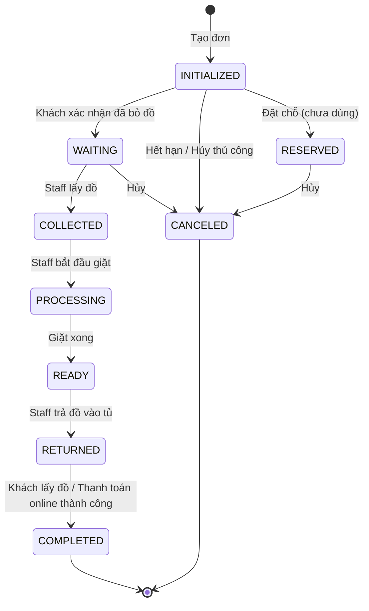

# 📋 Phân Tích Toàn Bộ Workflow Hệ Thống Laundry Locker Backend

<!-- CURRENT_STATUS_START -->
> **Cập nhật 2026-06-13:** Tài liệu này đã được rà soát để bám theo trạng thái hiện tại của dự án. Backend Phase 2 cho locker flow đã triển khai SEND / RENTAL / QR / RBAC / maintenance; FE admin build pass; Flutter mobile đã có luồng Customer, Manager và Maintenance. Nguồn trạng thái chuẩn: `laundry-locker-microservices/docs/CURRENT_PROJECT_STATUS.md`, `RUN_RESULT.md`, `LOCKER_FLOW_PLAN.md`.
<!-- CURRENT_STATUS_END -->

---

## 1. Tổng Hợp Roles & Các Enum Trạng Thái Cốt Lõi

### 1.1. Roles trong Hệ Thống

| Role | Mô tả |
|------|--------|
| **USER** | Khách hàng sử dụng dịch vụ giặt ủi/gửi đồ |
| **ADMIN** | Quản trị viên hệ thống, quản lý toàn bộ |
| **PARTNER** | Chủ cửa hàng giặt ủi, quản lý store và nhân viên |
| **Staff** *(actor ngoài)* | Nhân viên giặt ủi, được PARTNER quản lý qua [StaffAccessCode](file:///d:/BigProject/laundry-locker-backend/laundry-locker-backend/src/main/java/com/huynqb/laundrylockerbackend/module/partner/service/StaffAccessCodeService.java#37-305), **không phải** role trong hệ thống |

> [!IMPORTANT]
> Staff **không có tài khoản** trong hệ thống. Họ tương tác với tủ đồ thông qua **mã truy cập (AccessCode)** do Partner tạo ra. Đây là thiết kế cốt lõi để nhân viên thực địa không cần đăng nhập.

---

### 1.2. Enum Trạng Thái Cốt Lõi

#### 🔄 OrderStatus — Vòng đời đơn hàng (9 trạng thái)



| Giá trị | Ý nghĩa |
|---------|---------|
| `INITIALIZED` | Đơn vừa tạo, chờ khách bỏ đồ vào tủ |
| `RESERVED` | Đã đặt chỗ nhưng chưa kích hoạt |
| `WAITING` | Khách đã bỏ đồ, chờ staff đến thu gom |
| `COLLECTED` | Staff đã lấy đồ từ tủ |
| `PROCESSING` | Đồ đang được giặt/xử lý tại cửa hàng |
| `READY` | Đã giặt xong, chờ trả vào tủ |
| `RETURNED` | Đồ đã được trả vào tủ, chờ khách lấy |
| `COMPLETED` | Khách đã lấy đồ, đơn hoàn thành |
| `CANCELED` | Đơn bị hủy (thủ công hoặc tự động) |

---

#### 💳 PaymentStatus — Trạng thái thanh toán

| Giá trị | Ý nghĩa |
|---------|---------|
| `PENDING` | Chờ thanh toán (đã tạo payment, chờ callback) |
| `PROCESSING` | Đang xử lý thanh toán |
| `COMPLETED` | Thanh toán thành công |
| `FAILED` | Thanh toán thất bại |
| `REFUNDED` | Đã hoàn tiền |
| `CANCELED` | Thanh toán bị hủy |

#### 💰 PaymentMethod — Phương thức thanh toán

| Giá trị | Ý nghĩa |
|---------|---------|
| `CASH` | Tiền mặt |
| `WALLET` | Ví điện tử |
| `BANK_TRANSFER` | Chuyển khoản ngân hàng |
| `MOMO` | MoMo |
| `VNPAY` | VNPay |
| `ZALOPAY` | ZaloPay |

---

#### 🗄️ LockerStatus — Trạng thái tủ đồ

| Giá trị | Ý nghĩa |
|---------|---------|
| `ACTIVE` | Tủ đang hoạt động bình thường |
| `INACTIVE` | Tủ không hoạt động |
| `MAINTENANCE` | Tủ đang bảo trì |
| `DISCONNECTED` | Mất kết nối IoT |

#### 📦 BoxStatus — Trạng thái ngăn tủ

| Giá trị | Ý nghĩa |
|---------|---------|
| `AVAILABLE` | Ngăn trống, sẵn sàng sử dụng |
| `OCCUPIED` | Đang có đồ bên trong |
| `RESERVED` | Đã được đặt trước |
| `MAINTENANCE` | Đang bảo trì |

#### 📐 BoxSize — Kích thước ngăn tủ

`SMALL` · `MEDIUM` · `LARGE` · `EXTRA_LARGE`

---

#### 🤝 PartnerStatus — Trạng thái đối tác

| Giá trị | Ý nghĩa |
|---------|---------|
| `PENDING` | Mới đăng ký, chờ duyệt |
| `APPROVED` | Đã được Admin duyệt |
| `REJECTED` | Bị từ chối |
| `SUSPENDED` | Bị đình chỉ |

#### 🔑 AccessCodeStatus — Trạng thái mã truy cập Staff

| Giá trị | Ý nghĩa |
|---------|---------|
| `ACTIVE` | Mã đang hoạt động, có thể sử dụng |
| `USED` | Đã sử dụng |
| `EXPIRED` | Đã hết hạn |
| `CANCELLED` | Bị Partner hủy |

#### 🎯 AccessCodeAction — Loại hành động mã truy cập

| Giá trị | Ý nghĩa |
|---------|---------|
| `COLLECT` | Staff lấy đồ từ tủ (thu gom) |
| `RETURN` | Staff trả đồ lại vào tủ |

---

#### 🏪 StoreStatus — Trạng thái cửa hàng

`ACTIVE` · `INACTIVE` · `CLOSED`

#### 🧺 ServiceStatus — Trạng thái dịch vụ

`ACTIVE` · `INACTIVE`

#### 📂 ServiceCategory — Phân loại dịch vụ

| Giá trị | Ý nghĩa |
|---------|---------|
| `STORAGE` | Dịch vụ gửi đồ — giá cố định, thanh toán trước |
| `LAUNDRY` | Dịch vụ giặt — tính theo kg/món, thanh toán sau khi trả đồ |

#### 🏷️ ServiceType — Loại dịch vụ cụ thể

`STANDARD_DROPOFF` · `OVERNIGHT` · `LAUNDRY` · `EXPRESS_2H` · `MONTHLY_STUDENT` · `MONTHLY_SHIPPER` · `ADDITIONAL_FEE`

#### 💲 PricingType — Cách tính giá

| Giá trị | Ý nghĩa |
|---------|---------|
| `FIXED` | Giá cố định (biết lúc tạo đơn) |
| `PER_WEIGHT` | Tính theo cân nặng (ước lượng → chính xác sau khi cân) |
| `PER_PIECE` | Tính theo món (ước lượng → chính xác sau khi đếm) |

#### 🔔 NotificationType & NotificationStatus

**NotificationType:** `ORDER_STATUS` · `PICKUP_REMINDER` · `AUTO_CANCEL` · `PAYMENT` · `SYSTEM` · `PROMOTION` · `LOYALTY_REWARD`

**NotificationStatus:** `UNREAD` · `READ`

#### 🎖️ Loyalty Enums

**StampType:** `BOX` (stamp theo kích thước tủ) · `SERVICE` (stamp theo dịch vụ)

**StampTransactionType:** `EARN` · `REDEEM` · `ADJUST` · `BONUS`

**PointTransactionType:** `EARN` · `REDEEM` · `EXPIRE` · `ADJUST` · `BONUS` · `REFUND`

#### 🔐 AuthProvider

`LOCAL` · `GOOGLE` · `FACEBOOK` · `GITHUB` · `ZALO` · `PHONE` · `EMAIL`

---

## 2. Phân Tích Chi Tiết Workflow Theo Use Case

---

### Use Case 1: Khách Hàng Tạo Đơn và Gửi Đồ Vào Tủ

**Mô tả chung:** Khách hàng chọn dịch vụ (gửi đồ hoặc giặt), tạo đơn hàng, nhận mã PIN, đến tủ mở bằng PIN, bỏ đồ vào và xác nhận.

**Enum sử dụng:** [OrderStatus](file:///d:/BigProject/laundry-locker-backend/laundry-locker-backend/src/main/java/com/huynqb/laundrylockerbackend/module/order/service/OrderService.java#317-329), [BoxStatus](file:///d:/BigProject/laundry-locker-backend/laundry-locker-backend/src/main/java/com/huynqb/laundrylockerbackend/module/partner/helper/OrderBoxHelper.java#117-121), `PricingType`, `ServiceCategory`

---

#### Role: USER

**Context:** Khách mở app, chọn locker, chọn dịch vụ, tạo đơn hàng. Hệ thống cấp mã PIN. Khách đến tủ, nhập PIN trên tablet, mở tủ, bỏ đồ vào, xác nhận.

**Workflow & API:**

| Bước | API | Service Method | Mô tả |
|------|-----|---------------|-------|
| 1 | `POST /orders` | `OrderService.createOrder()` | Tạo đơn hàng mới |
| 2 | `POST /iot/verify-pin` | `IoTService.verifyPin()` | Xác thực PIN trên tablet |
| 3 | `POST /iot/unlock` | `IoTService.unlockBox()` | Mở khóa tủ qua PIN |
| 4 | `PUT /orders/{id}/confirm` | `OrderService.confirmOrder()` | Xác nhận đã bỏ đồ |

**State Transitions:**

```
1. Tạo đơn:
   OrderStatus:  [null] → INITIALIZED
   BoxStatus:    AVAILABLE → OCCUPIED (auto-assign hoặc chỉ định)
   ⮕ Hệ thống tạo mã PIN 6 chữ số + mã đơn ORD-YYYYMMDD-XXXXXX

2. Mở tủ (PIN hợp lệ):
   ⮕ Backend gửi MQTT OPEN → ESP8266 mở khóa vật lý
   ⮕ BoxStatus giữ nguyên OCCUPIED

3. Xác nhận đã bỏ đồ:
   OrderStatus:  INITIALIZED → WAITING
   ⮕ Gửi notification cho khách
```

> [!NOTE]
> Nếu khách **không xác nhận** trong 30 phút, [OrderSchedulerService](file:///d:/BigProject/laundry-locker-backend/laundry-locker-backend/src/main/java/com/huynqb/laundrylockerbackend/core/scheduler/OrderSchedulerService.java#25-278) tự động hủy:
> `OrderStatus: INITIALIZED → CANCELED`, `BoxStatus: OCCUPIED → AVAILABLE`

---

#### Role: ADMIN

**Context:** Admin có thể xem, hủy đơn hàng bất kỳ từ trang quản lý.

**Workflow & API:**

| API | Service Method | Mô tả |
|-----|---------------|-------|
| `GET /admin/orders` | `AdminOrderService.getOrders()` | Xem danh sách đơn |
| `PUT /orders/{id}/cancel` | `OrderService.cancelOrder()` | Hủy đơn hàng |

**State Transitions (Hủy đơn):**

```
OrderStatus:  INITIALIZED / RESERVED / WAITING → CANCELED
BoxStatus:    OCCUPIED → AVAILABLE  (giải phóng cả sendBox & receiveBox)
```

---

### Use Case 2: Staff Thu Gom Đồ Từ Tủ (COLLECT)

**Mô tả chung:** Khi đơn ở trạng thái WAITING, Partner tạo mã AccessCode (COLLECT) cho Staff. Staff đến tủ, nhập mã trên tablet, tủ mở ra, Staff lấy đồ mang về cửa hàng.

**Enum sử dụng:** [OrderStatus](file:///d:/BigProject/laundry-locker-backend/laundry-locker-backend/src/main/java/com/huynqb/laundrylockerbackend/module/order/service/OrderService.java#317-329), [BoxStatus](file:///d:/BigProject/laundry-locker-backend/laundry-locker-backend/src/main/java/com/huynqb/laundrylockerbackend/module/partner/helper/OrderBoxHelper.java#117-121), `AccessCodeStatus`, `AccessCodeAction`

---

#### Role: PARTNER

**Context:** Partner nhận thông báo có đơn hàng WAITING, chấp nhận đơn và tạo mã truy cập cho nhân viên.

**Workflow & API:**

| Bước | API | Service Method | Mô tả |
|------|-----|---------------|-------|
| 1 | `GET /partners/orders?status=WAITING` | `PartnerService.getPendingOrders()` | Xem đơn chờ thu gom |
| 2 | `POST /partners/orders/{id}/accept` | `PartnerService.acceptOrderAndGenerateCode()` | Chấp nhận + tạo AccessCode COLLECT |

**State Transitions:**

```
AccessCodeStatus: [null] → ACTIVE (tạo mới, hạn 24h mặc định)
AccessCodeAction: COLLECT
⮕ Mã code dạng "ABC123" gửi cho Staff
⮕ Nếu đã có code ACTIVE cũ → CANCELLED (hủy code cũ)
```

---

#### Role: Staff *(actor ngoài)*

**Context:** Staff nhận mã AccessCode từ Partner, đến tủ locker, nhập mã trên tablet IoT.

**Workflow & API:**

| Bước | API | Service Method | Mô tả |
|------|-----|---------------|-------|
| 1 | `POST /iot/unlock-with-code` | `StaffAccessCodeService.unlockWithCode()` | Nhập AccessCode để mở tủ |

**State Transitions:**

```
1. Xác thực mã:
   AccessCodeStatus:  ACTIVE → USED (đánh dấu đã dùng, lưu tên staff)

2. Mở tủ:
   ⮕ Backend gửi MQTT OPEN command đến ESP8266 cho từng box
   ⮕ Topic: locker/commands/{deviceId}
   ⮕ Payload: {"box_id": X, "action": "OPEN"}

3. Cập nhật đơn hàng:
   OrderStatus:  WAITING → COLLECTED
   BoxStatus:    OCCUPIED → AVAILABLE  (giải phóng sendBox sau khi lấy đồ)
```

> [!WARNING]
> Validate điều kiện: – Chỉ COLLECT được khi `OrderStatus == WAITING`
> – Mã AccessCode phải ACTIVE và chưa hết hạn
> – Đơn hàng phải thuộc store của Partner

---

### Use Case 3: Partner/Staff Xử Lý Giặt Đồ

**Mô tả chung:** Sau khi thu gom, Staff mang đồ về cửa hàng. Partner cập nhật trạng thái → PROCESSING, cân/đếm đồ thực tế, tính giá chính xác (với dịch vụ LAUNDRY).

**Enum sử dụng:** [OrderStatus](file:///d:/BigProject/laundry-locker-backend/laundry-locker-backend/src/main/java/com/huynqb/laundrylockerbackend/module/order/service/OrderService.java#317-329), `PricingType`

---

#### Role: PARTNER

**Context:** Partner cập nhật trạng thái đơn hàng và thông tin cân nặng thực tế.

**Workflow & API:**

| Bước | API | Service Method | Mô tả |
|------|-----|---------------|-------|
| 1 | `PUT /partners/orders/{id}/processing` | `PartnerService.updateOrderToProcessing()` | Bắt đầu xử lý |
| 2 | `PUT /partners/orders/{id}/weight` | `PartnerService.updateOrderWeight()` | Cập nhật cân nặng thực tế |
| 3 | `PUT /partners/orders/{id}/ready` | `PartnerService.markOrderReadyAndGenerateCode()` | Hoàn thành + tạo RETURN code |

**State Transitions:**

```
Bước 1:
   OrderStatus: COLLECTED → PROCESSING
   ⮕ Gửi notification: "Đồ đang được giặt/xử lý"
   ⮕ Validate: chỉ khi OrderStatus == COLLECTED

Bước 2 (cập nhật cân nặng):
   ⮕ Chỉ khi OrderStatus == COLLECTED hoặc PROCESSING
   ⮕ Cập nhật actualWeight, recalculate totalPrice nếu PricingType == PER_WEIGHT

Bước 3:
   OrderStatus: PROCESSING → READY  (hoặc COLLECTED → READY)
   AccessCodeStatus: [null] → ACTIVE (mã RETURN cho Staff)
   ⮕ Gửi notification: "Đồ đã giặt xong, chờ trả vào tủ"
```

---

### Use Case 4: Staff Trả Đồ Vào Tủ (RETURN)

**Mô tả chung:** Khi đồ giặt xong (READY), Staff dùng mã RETURN để mở tủ locker, bỏ đồ vào, hệ thống cập nhật trạng thái và sinh mã PIN mới cho khách.

**Enum sử dụng:** [OrderStatus](file:///d:/BigProject/laundry-locker-backend/laundry-locker-backend/src/main/java/com/huynqb/laundrylockerbackend/module/order/service/OrderService.java#317-329), [BoxStatus](file:///d:/BigProject/laundry-locker-backend/laundry-locker-backend/src/main/java/com/huynqb/laundrylockerbackend/module/partner/helper/OrderBoxHelper.java#117-121), `AccessCodeStatus`, `AccessCodeAction`

---

#### Role: Staff *(actor ngoài)*

**Context:** Staff nhận mã RETURN từ Partner, mang đồ đến tủ, nhập mã trên tablet.

**Workflow & API:**

| Bước | API | Service Method | Mô tả |
|------|-----|---------------|-------|
| 1 | `POST /iot/unlock-with-code` | `StaffAccessCodeService.unlockWithCode()` | Nhập mã RETURN để mở tủ |

**State Transitions:**

```
1. Xác thực mã:
   AccessCodeStatus: ACTIVE → USED

2. Mở tủ:
   ⮕ Backend gửi MQTT OPEN đến ESP8266
   ⮕ Topic: locker/commands/{deviceId}
   ⮕ Payload: {"box_id": X, "action": "OPEN"}

3. Cập nhật đơn:
   OrderStatus:  READY → RETURNED
   BoxStatus:    AVAILABLE → OCCUPIED  (receiveBox đánh dấu có đồ)
   ⮕ Sinh mã PIN mới cho khách
   ⮕ Set pickupDeadline = now + 24h (cho tính phí quá hạn)

4. Thông báo:
   ⮕ Gửi notification cho khách: "Đồ đã trả vào tủ, mã PIN: XXXXXX"
```

---

#### Role: PARTNER *(luồng thay thế qua OrderService)*

**Context:** Partner cũng có thể trả đồ trực tiếp (không qua AccessCode) nếu Partner có tài khoản staff.

| API | Service Method |
|-----|---------------|
| `PUT /orders/{id}/return` | `OrderService.returnOrder(orderId, boxId, staffId)` |

**State Transitions:** Tương tự Staff, nhưng yêu cầu `OrderStatus == READY`.

---

### Use Case 5: Khách Hàng Lấy Đồ (Pickup)

**Mô tả chung:** Khách nhận thông báo, đến tủ nhập PIN lấy đồ. Có 2 cách hoàn thành: (a) tự xác nhận qua app, (b) thanh toán online xong tự hoàn thành.

**Enum sử dụng:** [OrderStatus](file:///d:/BigProject/laundry-locker-backend/laundry-locker-backend/src/main/java/com/huynqb/laundrylockerbackend/module/order/service/OrderService.java#317-329), [BoxStatus](file:///d:/BigProject/laundry-locker-backend/laundry-locker-backend/src/main/java/com/huynqb/laundrylockerbackend/module/partner/helper/OrderBoxHelper.java#117-121), `PaymentStatus`

---

#### Role: USER

**Context:** Khách nhận thông báo "Đồ đã sẵn sàng", đến tủ, nhập PIN trên tablet, mở tủ lấy đồ.

**Workflow & API:**

| Bước | API | Service Method | Mô tả |
|------|-----|---------------|-------|
| 1 | `POST /iot/verify-pin` | `IoTService.verifyPin()` | Xác thực PIN tại tủ |
| 2 | `POST /iot/unlock` | `IoTService.unlockBox()` | Mở tủ |
| 3a | `POST /iot/pickup` | `IoTService.confirmPickup()` | Xác nhận lấy đồ (qua IoT) |
| 3b | `PUT /orders/{id}/complete` | `OrderService.completeOrderByCustomer()` | Xác nhận lấy đồ (qua app) |

**State Transitions:**

```
1. Mở tủ:
   ⮕ Validate: OrderStatus == RETURNED, PIN khớp receiveBox
   ⮕ Backend gửi MQTT OPEN → ESP8266

2. Xác nhận lấy đồ:
   OrderStatus:  RETURNED → COMPLETED
   BoxStatus:    OCCUPIED → AVAILABLE  (giải phóng receiveBox)
   ⮕ Xóa PIN code
   ⮕ Tính phí quá hạn nếu lấy trễ (> 24h):
     overtimeFee = overtimeHours × 500đ/giờ
     Cap: min(maxOvertimeFee=50000đ, totalPrice × 50%)
```

> [!CAUTION]
> Nếu khách **lấy đồ trễ hơn 24 giờ** kể từ khi trả vào tủ (`pickupDeadline`), hệ thống tự động tính phí trễ hạn cộng vào đơn hàng.

---

### Use Case 6: Thanh Toán Online (VNPay / MoMo)

**Mô tả chung:** Đối với dịch vụ LAUNDRY, khách thanh toán sau khi đồ được trả vào tủ. Hệ thống hỗ trợ VNPay và MoMo.

**Enum sử dụng:** `PaymentStatus`, `PaymentMethod`, [OrderStatus](file:///d:/BigProject/laundry-locker-backend/laundry-locker-backend/src/main/java/com/huynqb/laundrylockerbackend/module/order/service/OrderService.java#317-329)

---

#### Role: USER

**Context:** Khách chọn phương thức thanh toán, được chuyển đến gateway, thanh toán xong quay lại.

**Workflow & API:**

| Bước | API | Service Method | Mô tả |
|------|-----|---------------|-------|
| 1 | `POST /payments` | `PaymentService.createPayment()` | Tạo payment + lấy URL thanh toán |
| 2 | *Redirect → Gateway* | — | Khách thanh toán trên VNPay/MoMo |
| 3a | `GET /payments/vnpay/ipn` | `PaymentService.processVNPayIpn()` | VNPay callback (server-to-server) |
| 3b | `POST /payments/momo/callback` | `PaymentService.processMoMoCallback()` | MoMo callback |
| 4 | `GET /payments/vnpay/return` | `PaymentService.processVNPayReturn()` | VNPay return URL |

**State Transitions:**

```
Điều kiện tạo payment: OrderStatus == RETURNED hoặc READY

1. Tạo payment:
   PaymentStatus: [null] → PENDING

2a. Callback thành công (VNPay/MoMo):
   PaymentStatus: PENDING → COMPLETED
   OrderStatus:   [giữ nguyên] → COMPLETED  (completeOrderPayment)

2b. Callback thất bại:
   PaymentStatus: PENDING → FAILED
   OrderStatus:   giữ nguyên (khách có thể thử lại)
```

> [!NOTE]
> Nếu đã có `PaymentStatus.COMPLETED` cho đơn → throw "Order already paid" (tránh thanh toán trùng).

---

### Use Case 7: Đăng Ký & Duyệt Partner

**Mô tả chung:** User đăng ký trở thành Partner, Admin duyệt/từ chối. Sau khi duyệt, Partner được gán role PARTNER.

**Enum sử dụng:** `PartnerStatus`, `RoleName`

---

#### Role: USER → PARTNER

**Workflow & API:**

| Bước | API | Service Method | Mô tả |
|------|-----|---------------|-------|
| 1 | `POST /partners/register` | `PartnerService.registerPartner()` | Đăng ký Partner |

**State Transitions:**

```
PartnerStatus: [null] → PENDING
⮕ Tài khoản vẫn giữ role USER, chờ Admin duyệt
```

---

#### Role: ADMIN

**Workflow & API:**

| API | Service Method | Mô tả |
|-----|---------------|-------|
| `GET /admin/partners?status=PENDING` | `PartnerService.getAllPartners()` | Xem danh sách đợi duyệt |
| `PUT /admin/partners/{id}/approve` | `PartnerService.approvePartner()` | Duyệt |
| `PUT /admin/partners/{id}/reject` | `PartnerService.rejectPartner()` | Từ chối |
| `PUT /admin/partners/{id}/suspend` | `PartnerService.suspendPartner()` | Đình chỉ |

**State Transitions:**

```
Duyệt:
   PartnerStatus: PENDING → APPROVED
   ⮕ Gán role PARTNER cho User
   ⮕ Lưu approvedAt, approvedBy

Từ chối:
   PartnerStatus: PENDING → REJECTED
   ⮕ Lưu rejectionReason

Đình chỉ:
   PartnerStatus: APPROVED → SUSPENDED
   ⮕ Partner không thể truy cập các API yêu cầu APPROVED
```

---

### Use Case 8: Các Tác Vụ Tự Động (Scheduler)

**Mô tả chung:** Hệ thống có 3 scheduled task chạy tự động để duy trì trạng thái nhất quán.

| Task | Tần suất | Mô tả | State Transitions |
|------|----------|-------|------------------|
| **Auto-Cancel** | Mỗi 5 phút | Hủy đơn INITIALIZED quá 30 phút | `OrderStatus: INITIALIZED → CANCELED`<br>`BoxStatus: OCCUPIED → AVAILABLE` |
| **Auto-Release Box** | Mỗi 2 phút | Giải phóng box từ đơn COMPLETED sau 5 phút | `BoxStatus: OCCUPIED/RESERVED → AVAILABLE`<br>Xóa PIN, xóa tham chiếu box |
| **Pickup Reminder** | Mỗi 1 giờ | Nhắc nhở lấy đồ quá 24h | Gửi notification `PICKUP_REMINDER` |

**Enum sử dụng:** [OrderStatus](file:///d:/BigProject/laundry-locker-backend/laundry-locker-backend/src/main/java/com/huynqb/laundrylockerbackend/module/order/service/OrderService.java#317-329), [BoxStatus](file:///d:/BigProject/laundry-locker-backend/laundry-locker-backend/src/main/java/com/huynqb/laundrylockerbackend/module/partner/helper/OrderBoxHelper.java#117-121), `NotificationType`

---

## 3. Luồng Giao Tiếp MQTT Chi Tiết

### 3.1. Kiến trúc MQTT

```
┌────────────┐     MQTT Publish      ┌────────────┐     Subscribe      ┌──────────────┐
│  Backend   │ ───────────────────→  │   MQTT     │ ─────────────────→ │  ESP8266     │
│  (Java)    │                       │   Broker   │                    │  (Locker)    │
└────────────┘                       │ (HiveMQ)   │                    └──────────────┘
       │                             └────────────┘                           │
       │                                                                       │
       │            HTTP POST /iot/box-status                                 │
       │ ←───────────────────────────────────────────────────────────────────  │
       │            {"boxId": X, "status": "OCCUPIED"}                        │
```

### 3.2. Backend → Thiết bị (Gửi lệnh)

| Khi nào | Topic | Payload | Trigger |
|---------|-------|---------|---------|
| Khách nhập PIN mở tủ | `locker/commands/{deviceId}` | `{"box_id": X, "action": "OPEN"}` | `IoTService.unlockBox()` |
| Staff nhập AccessCode mở tủ | `locker/commands/{deviceId}` | `{"box_id": X, "action": "OPEN"}` | `StaffAccessCodeService.unlockWithCode()` |
| Khóa tủ (nếu cần) | `locker/commands/{deviceId}` | `{"box_id": X, "action": "LOCK"}` | `LockerMqttService.sendLockCommand()` |

> **deviceId** = `locker.code` (ví dụ: `ESP8266_LOCKER_01`)
> **QoS** = 1 (at-least-once delivery)

### 3.3. Thiết bị → Backend (Báo cáo trạng thái)

| Khi nào | API | Payload | Kết quả |
|---------|-----|---------|---------|
| Tủ đóng/mở, cảm biến thay đổi | `POST /iot/box-status` | `{"boxId": X, "status": "OCCUPIED"}` | [BoxStatus](file:///d:/BigProject/laundry-locker-backend/laundry-locker-backend/src/main/java/com/huynqb/laundrylockerbackend/module/partner/helper/OrderBoxHelper.java#117-121) cập nhật theo giá trị nhận được |

> [!IMPORTANT]
> **MQTT là best-effort.** Nếu gửi lệnh MQTT thất bại, hệ thống KHÔNG rollback trạng thái đơn hàng. Lệnh mở tủ vẫn được coi là thành công ở tầng logic. ESP8266 có thể retry nhờ `automaticReconnect = true`.

---

## 4. Tổng Hợp: Vòng Đời Đầy Đủ Một Đơn Hàng LAUNDRY

```
KHÁCH (USER)                PARTNER                     STAFF (Actor ngoài)
    │                           │                            │
    │─── POST /orders ─────→    │                            │
    │    [INITIALIZED]          │                            │
    │    Box: AVAILABLE→OCCUPIED│                            │
    │                           │                            │
    │─── POST /iot/unlock ──→   │                            │
    │    [MQTT: OPEN → ESP]     │                            │
    │                           │                            │
    │─── PUT /confirm ──────→   │                            │
    │    [WAITING]              │                            │
    │                           │                            │
    │                     ←── Notification                   │
    │                           │                            │
    │                    POST /partners/orders/{id}/accept   │
    │                    [Tạo AccessCode COLLECT]            │
    │                           │──── Gửi mã cho Staff ────→ │
    │                           │                            │
    │                           │                  POST /iot/unlock-with-code
    │                           │                  [COLLECTED, Box→AVAILABLE]
    │                           │                  [MQTT: OPEN → ESP]
    │                           │                            │
    │                    PUT /processing                     │
    │    ← Notification  [PROCESSING]                       │
    │                           │                            │
    │                    PUT /weight (cập nhật cân nặng)     │
    │                           │                            │
    │                    PUT /ready                          │
    │    ← Notification  [READY + AccessCode RETURN]        │
    │                           │──── Gửi mã RETURN ──────→ │
    │                           │                            │
    │                           │                  POST /iot/unlock-with-code
    │                           │                  [RETURNED, Box→OCCUPIED]
    │                           │                  [MQTT: OPEN → ESP]
    │                           │                  [Sinh PIN mới cho khách]
    │                           │                            │
    │    ← Notification "Đồ sẵn sàng, PIN: XXXXXX"         │
    │                           │                            │
    │─── POST /payments ────→   │                            │
    │    [PaymentStatus: PENDING]                            │
    │─── VNPay/MoMo gateway ─→  │                            │
    │    [COMPLETED upon callback]                           │
    │                           │                            │
    │─── POST /iot/unlock ──→   │                            │
    │    [MQTT: OPEN → ESP]     │                            │
    │─── POST /iot/pickup ──→   │                            │
    │    [COMPLETED]            │                            │
    │    Box: OCCUPIED→AVAILABLE│                            │
    │    PIN: cleared           │                            │
    ▼                           ▼                            ▼
```
